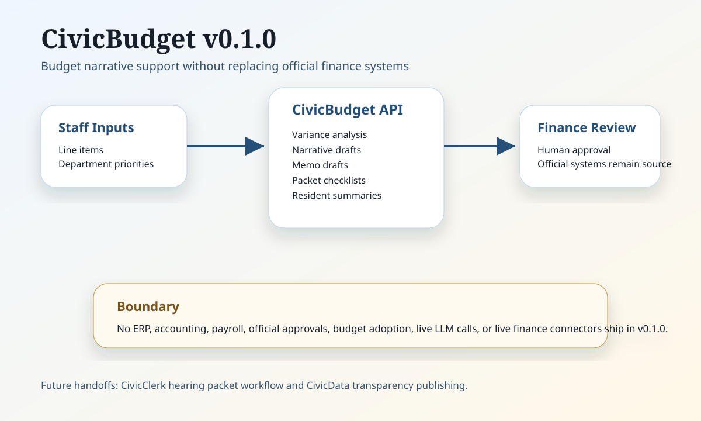

# CivicBudget Architecture

CivicBudget v0.1.0 is a local module foundation. It takes staff-provided budget facts, produces reviewable drafting artifacts, and keeps official budget decisions outside the module.

## Current v0.1.0 Components

- FastAPI runtime for health, public module page, and deterministic JSON endpoints.
- Line-item variance analysis helpers.
- Budget narrative and memo draft helpers.
- Hearing packet checklist helper for future CivicClerk handoff.
- Resident summary helper for future CivicData transparency publishing.
- GFOA checklist helper that does not certify compliance.

## External Systems

ERP, budgeting, accounting, payroll, fund accounting, and official approval systems remain authoritative. CivicBudget v0.1.0 does not connect to them directly.

## Future Integration Points

- Read-only finance-system imports.
- CivicClerk packet handoff.
- CivicData public transparency publishing.
- Finance approval workflow and signed publication records.
